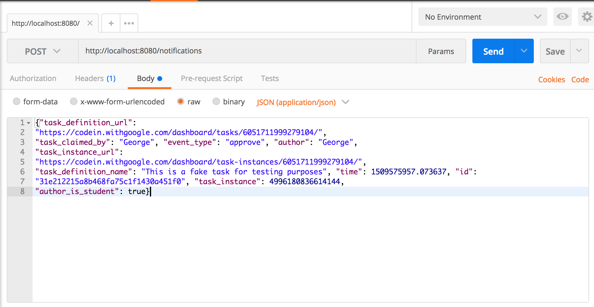
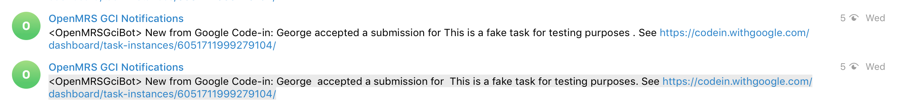

# OpenMRS GCI BOT

[Google Code-in](https://developers.google.com/open-source/gci/)(GCI) Webhook Notifications are intended to let your organization learn about events that happen on your tasks in real-time. This bot listens to task updates from GCI and sends them to a channel accessible only to mentors. You probably don't want to share that other students are abandoning tasks or every time a student comments on a task. Imagine how a student would feel if all the other students knew that their task kept being sent for more work over and over again.)

Despite what the name suggests. This bot is not limited to OpenMRS. Any organization that uses telegram for communication can easily set this up to work with their organization with no code modifications. If your org uses a different chat system, you'll need to do minor code modifications to make the bot communicate with your chat api instead of telegram api.

# Features

* Listen to updates from Google Code-in and send to telegram channel

Bot is still in development and other features may be added. See TODOs below.

# Prerequisites

This is a [Spring Boot](https://projects.spring.io/spring-boot/) app and uses [Maven](https://maven.apache.org/) for dependency management. To run this app you need to have the following installed

* Java
* Maven
* [Spring Boot CLI](https://docs.spring.io/spring-boot/docs/current/reference/htmlsingle/#getting-started-installing-the-cli)(Optional)

The Spring Boot CLI is optional. You don't need to have it to be able to run or develop on this project. I don't. But just thought I should share since it provides a lot of features you might find interesting.

# Setup

* Clone the repo (you should fork and clone your fork instead if you plan to make contributions)

    `git clone https://github.com/ivange94/openmrs-gci-bot.git`
    
The bot needs a config.json file to tell it how to work. The bot needs your telegram access token, telegram chat id(id of the channel you wish to be posting updates too) and your google code-in access token. The config.json file should look something like this

```json
{
  "gciApiKey": "put_your_gci_api_key_here",
  "telegramApiKey": "telegram_api_key",
  "telegramChatId": -1001018013852
}
``` 

You have to create this file in /openmrs-gci-bot/src/main/resources/config.json. This file is not committed to git for obvious reasons. You wouldn't want to make public your private information on GitHub. It is important that you have the file in that exact location with that exact name else you will have a file not found exception when the project tries to read the config file on startup.
    
For instructions on how to get gci api key, see the [Google Code-in API](https://developers.google.com/open-source/gci/resources/downloads/TaskAPISpec.pdf).
For instructions on how to get your telegram api key, see [Telegram Bot API](https://core.telegram.org/bots/api)
See this doc for how to get your chat_id [Telegram Web Channel ID](https://github.com/GabrielRF/telegram-id#web-channel-id) 
    
* Build the and run the project

    `cd openmrs-gci-bot`
    
    `mvn package`
    
* Run the application

After building the project a target directory will be created with an executable jar. Which you can run with the command below

    `java -jar target/openmrs-gci-bot-0.0.1-SNAPSHOT.jar
    
## You can also build and run your application with just a single command

Make sure you are in the root directory of the project and execute

    `mvn spring-boot:run`
    
That will build and run your project for you. 
    
A tomcat server will be started on localhost:8080. You can use any REST client like [cURL](https://www.ethanmick.com/getting-started-with-curl/) or [Postman](https://www.getpostman.com/apps) to test this app. 

**Note** You don't need to have tomcat installed to be able to run this application. Spring boot starts an embedded tomcat for you everytime you run the application.

**Note** To actually use this in production you'll have to deploy it to a public server and send this url https://{yourserver_base_url}/notifications to Google Code-in support to register your webhook.

# Testing

To test this bot locally you'll need a REST client. I use postman. Make sure you have a telegram channel and a telegram bot added as admin to that channel with privileges to send messages.

Using a REST client of your choice you can do a POST to http://localhost:8080/notifications with the following json body

```json
    {"task_definition_url":
    "https://codein.withgoogle.com/dashboard/tasks/6051711999279104/",
    "task_claimed_by": "George", "event_type": "approve", "author": "George",
    "task_instance_url":
    "https://codein.withgoogle.com/dashboard/task-instances/6051711999279104/",
    "task_definition_name": "This is a fake task for testing purposes", "time": 1509575957.073637, "id":
    "31e212215a8b468fa75c1f1430a451f0", "task_instance": 4996180836614144,
    "author_is_student": true}
```

You should see a message posted to your channel like this 

`<OpenMRSGciBot> New from Google Code-in: George  accepted a submission for  This is a fake task for testing purposes. See https://codein.withgoogle.com/dashboard/task-instances/6051711999279104/`

### Screenshots

* Making POST 



* Message sent to telegram channel



# Notes for Developers

* On startup the config.json file is parsed to a Config java object. You can have access to this object anywhere in the project just by autowiring it like
  
  ```java
      @Autowired
      private Config config;
  ```
    
  Then you can obtain your configuration settings like
  
  ```java

    private static final String TELEGRAM_API_KEY = config.getTelegramApiKey();
    private static final String GCI_API_KEY = config.getGciApiKey();
    private static final String TELEGRAM_CHAT_ID = config.getTelegramChatId();
  ```
  
  You don't have to store them in constants, it's used there just for demonstration. For an example see [BotController.java](https://github.com/ivange94/openmrs-gci-bot/blob/master/src/main/java/org/openmrs/bot/openmrsgcibot/controller/BotController.java)
  
  Please avoid instantiating `org.openmrs.bot.openmrsgcibot.Config`. There will always be an instance available for you instantiated as a spring bean. Just use autowiring like above to get an instance of it. You may run into unexpected behavior or risk exposing your private information if you create your own instances of that class.
                                                                                                                                                                                                                                                                                                                                                                                                                                                                                                                                                                                                                                                                                                                                                                                                                                                                         
# TO-DO list

* Deploy to Heroku and send link to app to gci-support.

* Add CI/CD 

* Make bot interactive by having commands to get users interact with the bot. For example, have the following commands

    **openmrs_gci_bot submit** This command should return all tasks that have been submitted for review

    **openmrs_gci_bot abandoned** This command should return all tasks that were abandoned.
    
    
# Contributing

Your contributions are welcome. If you find a bug or have a great future you want to implement please create an issue then submit pull request to the project.

# Authors

* **[Ivange Larry](https://github.com/ivange94)** - Creator - GCI 2017 Org Admin @OpenMRS

See also the list of [contributors](https://github.com/ivange94/openmrs-gci-bot/graphs/contributors) who participated in this project.

# License

This project is licensed under the MIT License - see the [LICENSE](LICENSE) file for details


                                                                                                                                                                                                                                                                                                                                                                                                                                                                                                                                                                                                                                                                                                                           
